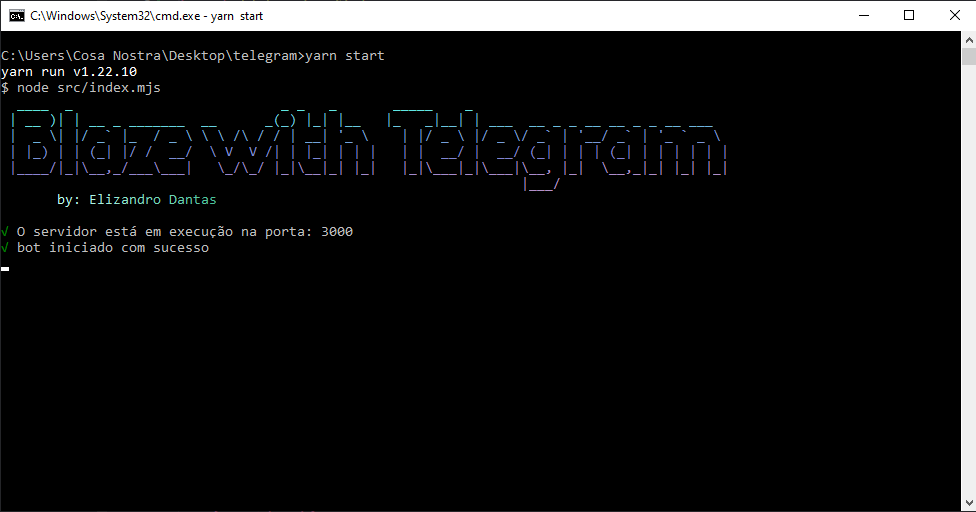

<div id="topo"></div>

<div align="center">
    <a style="text-decoration: none" href="https://blaze.com/r/dZONo">
        
    </a>
</div>

<h2 align="center"> Bot Blaze Double </h2>

A [blaze.com](https://blaze.com/r/dZONo), site de aposta online, operada pela empresa **Prolific Trade N.V.** e bastante popular nas mídias sociais. Em um de seus jogos, o jogador aposta entre 3 cores (vermelho 🔴, preto ⚫️ e branco ⚪️) e o valor apostado pode multiplicar até 14x.

O objetivo deste bot é enviar, após uma [analise](#analise), sinais do resultado da proxima rodada para grupos/canais/chat do telegram.

### Analise
* Alterações de analise podem ser feitas no arquivo [`analise.mjs`](https://github.com/elizandrodantas/bot-blaze-telegram/blob/main/src/core/analise.mjs)

<p align="right"><a href="#topo">topo</a></p>

## Visualizar


<p align="right"><a href="#topo">topo</a></p>

## Requisitos

* [NodeJs](https://nodejs.org/en/download/)
* [Git](https://git-scm.com/downloads)

<p align="right"><a href="#topo">topo</a></p>

## Instalação

1. **Clone o repositório**
```sh
git clone https://github.com/elizandrodantas/bot-blaze-telegram
```

2. **Instalar as dependencias**
- npm
```sh
npm install
```
- yarn
```sh
yarn
```

3. **Variáveis de ambiente `(.env)`**
_dentro do repositorio existe um arquivo de exemplo `(.env.example)`_

```js
URL_BLAZE="" // url WS da blaze
BASE_URL="" // base url do site da blaze
BOT_TOKEN="" // token do bot telegram
ID_GROUP_MESSAGE="" // id do grupo/canal/chat do telegram que ira receber os sinais (string ou string[])
// ID_GROUP_MESSAGE=[""]

/**
 * Variáveis não obrigatorias
*/

REF="" // envia em todo sinal um link da blaze com sua referencia
SAFE_AFTER_LOSS="" // apos um loss, ele passara um tempo entre 2 e 4 minutos para entrar em uma proxima jogada, depois disso começa analisar novamente
HEROKU_URL="" // ativa o loop para acessar url a cada 25m
```

<p align="right"><a href="#topo">topo</a></p>

## Uso

- npm
```sh
npm start
```

ou

- yarn
```sh
yarn start
```

</br>



<p align="right"><a href="#topo">topo</a></p>

## Contato

Instagram: <a href="https://www.instagram.com/elizandrodantas/" target="_blank">Elizandro Dantas</a>

<p align="right"><a href="#topo">topo</a></p>