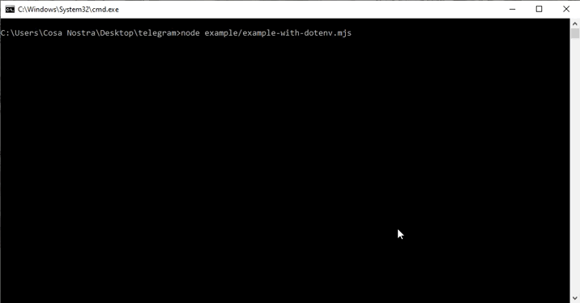

<div id="topo"></div>

<div align="center">
    <a style="text-decoration: none" href="https://blaze.com/r/dZONo">
        
    </a>
</div>

<h2 align="center"> Bot Blaze Double </h2>

A [blaze.com](https://blaze.com/r/dZONo), site de aposta online, operada pela empresa **Prolific Trade N.V.** e bastante popular nas mídias sociais. Em um de seus jogos, o jogador aposta entre 3 cores (vermelho 🔴, preto ⚫️ e branco ⚪️) e o valor apostado pode multiplicar até 14x.

O objetivo deste bot é enviar, após uma [analise](#analise), sinais do resultado da proxima rodada para grupos/canais/chat do telegram.

**❤️ Donation ❤️:** `ce71c8ba-4c42-4a72-85b4-64fbe3ace08e` _chave aleatoria_ **NuBank 💜**

## Analise 
- _as entradas são feitas por condições definidas na analise;_
- _essa analise não é 100% eficaz, desenvolva sua própria análise caso queira melhores resultados;_
- alterações de analise podem ser feitas no arquivo [`analise.mjs`](https://github.com/elizandrodantas/bot-blaze-telegram/blob/main/src/core/analise.mjs).

<p align="right"><a href="#topo">topo</a></p>

## Novidades (v0.1.37)

* Correção de bugs:
    - Travamento da blaze;
    - Tempo no loss;
    - Mensagem estática de gale.

<p align="right"><a href="#topo">topo</a></p>

## Visualizar



<p align="right"><a href="#topo">topo</a></p>

## Requisitos

* [NodeJs](https://nodejs.org/en/download/)
* [Git](https://git-scm.com/downloads)

<p align="right"><a href="#topo">topo</a></p>

## Instalação

1. **Clone o repositório**
```sh
git clone https://github.com/elizandrodantas/bot-blaze-telegram
```

2. **Instalar as dependencias**
- npm
```sh
npm install
```
- yarn
```sh
yarn
```

3. **Variáveis de ambiente `(.env)`**
_dentro do repositorio existe um arquivo de exemplo `(.env.example)`_

```js
URL_BLAZE="" // url WS da blaze
BASE_URL="" // base url do site da blaze
BOT_TOKEN="" // token do bot telegram
ID_GROUP_MESSAGE="" // id do grupo/canal/chat do telegram que ira receber os sinais (string)
```

_caso as variaveis não forem encontradas dentro do processo, serão setados em forma de input no console_ **(>= v0.1.1\*)**

<p align="right"><a href="#topo">topo</a></p>

## Uso

```javascript
import { BotBlazeWithTelegram } from './src/index.mjs';

new BotBlazeWithTelegram(options).run();
```

_as opções estão detalhadas em [opções](#opções)_

<p align="right"><a href="#topo">topo</a></p>

## Opções

#### Interface
```ts
interface IConstructorClassDad {
    timeAfterWin?: boolean | IOptionsTimePaused;
    timeAfterLoss?: boolean | IOptionsTimePaused;
    refBlaze?: string;
    sticker: ISticker;
    summaryOfResult?: boolean | IOptionsSummaryOfResult;
    gale?: boolean | number;
    messageEnterBet: ICBCurrentAndRecents;
    messageWin: ICBCurrentAndPlayed;
    messageLoss: ICBCurrentAndPlayed;
    messageOfGale: ICBCurrentAndPlayedAndGale
}

interface IOptionsTimePaused {
    time: number;
    message: string;
}

interface ISticker {
    win: string;
    winGale: string;
    loss: string;
    winWhite: string;
}

interface IOptionsSummaryOfResult {
    interval: number;
    message: (number: INumberSummary, info: IInfoSummary, cb?: (message: string) => void); 
}

interface INumberSummary {
    win: number;
    loss: number;
    gale: number;
    gale1: number;
    gale2: number;
    white: number;
    consecutive: number;
    total: number;
}

interface IInfoSummary {
    date: string;
    lastUpdate: number;
    day: number;
}

interface IDataBlazeResponse {
    id: string;
    color: number;
    roll: number;
    created_at: string;
    server_seed: string;
}

interface IGale {
    sequence: number;
    phase: string;
}

type ICB = (message: string) => void;

type ICBCurrentAndRecents = (currentPlay: IDataBlazeResponse, recents: IDataBlazeResponse[], cb: ICB) => string;

type ICBCurrentAndPlayed = (currentPlay: IDataBlazeResponse, betplayed: IDataBlazeResponse, cb: ICB) => string;

type ICBCurrentAndPlayedAndGale = (currentPlay: IDataBlazeResponse, betplayed: IDataBlazeResponse, gale: IGale, cb: ICB) => string;
```

#### Detalhes
* **IConstructorClassDad.timeAfterWin** _pausa as entradas do bot apos um **WIN**_
    - `IConstructorClassDad.timeAfterWin.message` - mensagem apresentada quando pausa ativa (padrão: sem mensagem)
    - `IConstructorClassDad.timeAfterWin.time` - tempo que ficara em pausa _em minutos_ (padrão: 3)
* **IConstructorClassDad.timeAfterLoss** _pausa as entradas do bot apos um **LOSS**_
    - `IConstructorClassDad.timeAfterLoss.message` - mensagem apresentada quando pausa ativa (padrão: sem mensagem)
    - `IConstructorClassDad.timeAfterLoss.time` - tempo que ficara em pausa _em minutos_ (padrão: 3)
* **IConstructorClassDad.refBlaze** _codigo de referencia blaze_
* **IConstructorClassDad.sticker** _os arquivos devem ficar na pasta **sticker** na raiz_
    - `IConstructorClassDad.sticker.win` - nome da figura quando resultado: WIN sem GALE
    - `IConstructorClassDad.sticker.winGale` - nome da figura quando resultado: WIN no GALE
    - `IConstructorClassDad.sticker.loss` - nome da figura quando resultado: LOSS
    - `IConstructorClassDad.sticker.winWhite` - nome da figura quando resultado: WHITE
* **IConstructorClassDad.summaryOfResult** _opções de resumo_
    - `IConstructorClassDad.summaryOfResult.interval` - intervalo para envio de mensagem. obs.: caso valor `1`, a cada 1 jogada ele enviara o resumo
    - `IConstructorClassDad.summaryOfResult.message` - mensagem personalizada
* **IConstructorClassDad.gale** _caso verdadeiro, não fara entrada nas jogadas gale_
* **IConstructorClassDad.messageEnterBet** _mensagem personalizada de entrada_
* **IConstructorClassDad.messageWin** _mensagem personalizada quando resultado: WIN_
* **IConstructorClassDad.messageLoss** _mensagem personalizada quando resultado: LOSS_
* **IConstructorClassDad.messageOfGale** _mensagem personalizada quando entrar em uma GALE_

### Todas opões com forma de uso:
```js
{
    //tempo após win
    timeAfterWin: true,
    // or
    timeAfterWin: {
        message: "mensagem",
        time: 1
    },

    // tempo após loss
    timeAfterLoss: true,
    // or
    timeAfterLoss: {
        message: "mensagem",
        time: 1
    },
    
    // sticker/figura
    // nessa opção podem ser usado imagens que estão dentro da pasta STICKER
    sticker: {
        win: "win.jpg",
        winGale: "win-in-gale.jpg",
        winWhite: "win-white.jpg",
        loss: "loss.jpg",
    },

    //envio de mensagens com resumo do dia
    summaryOfResult: {
        interval: 2 // a cada 2 jogadas, ele enviara mensagem personalizada abaixo
        message: function(number, info, cb){
            // number - numeros do resumo (todos possiveis estão em interface "INumberSummary")
            // info - informações do resumo (todos possiveis estão em interface "IInfoSummary")
            // cb - esse callback é uma ou mais mensagens que podem ser enviados alem do retorno desta, o valor request apenas uma string ( ex: cb('mensagem sobressalente') )


            // opção de outras mensagens (não obrigatorio)
            cb("mensagem sobressalente");

            return "Total de jogadas: ${number.total}" +
                "\nWins seguidos: ${number.consecutive} ✅" +
                "\nTotal de win: ${number.win} ✅" +
                "\nTotal de loss: ${number.loss} ❌" +
                "\nTaxa de acertividade: ${(number.win / number.total * 100).toFixed(1)}%";
        }
    },

    // Opção de entrada nas jogadas gale
    gale: false, // não entra
    gale: 2, // vai ate a gale 2

    // Mensagem personalizada de entrada
    messageEnterBet: (current, recents, cb) => {
        // current - ultima jogada
        // recents - ultimas 20 jogadas
        // cb - envio de mensagens sobressalentes .:. ex: cb('test callback');

        return "🔎 <b>SINAL ENCONTRADO:</b>\n" +
            `\nENTRE NO ${_getColorNameOrEmoticon(current.color, { emoticon: true })} ${_getColorNameOrEmoticon(current.color, { pt: true, upper: true })}` +
            `\nPROTEJA NO ${_getColorNameOrEmoticon(0, { emoticon: true })} ${_getColorNameOrEmoticon(0, { pt: true, upper: true })}` +
            `\n\n<pre>https://blaze.com/${process.env.REF ? "r/" + process.env.REF : ""}</pre>`;
    },

    // Mensagem personalizada de Win
    messageWin: (current, betplayed, cb) => {
        // current - ultima jogada
        // betplayed - dados da entrada
        // cb - envio de mensagens sobressalentes .:. ex: cb('test callback');

        return `🔸 ENTRAMOS NO ${_getColorNameOrEmoticon(betplayed.color, { emoticon: true })}` +
            `\n🔹 RESULTADO FOI ${_getColorNameOrEmoticon(current.color, { emoticon: true })}`;
    },

    // Mensagem personalizada de Gale
    messageOfGale: (current, betplayed, gale, cb) => {
        // current - ultima jogada
        // betplayed - dados da entrada
        // gale - informações do gale
        // cb - envio de mensagens sobressalentes .:. ex: cb('test callback');

        return `⚠️ <b>ENTROU PRA GALE ${gale.sequence + 1}:</b>\n` +
            `\nENTRE NO ${_getColorNameOrEmoticon(betplayed.color, { emoticon: true })} ${_getColorNameOrEmoticon(betplayed.color, { pt: true, upper: true })}` +
            `\nPROTEJA NO ${_getColorNameOrEmoticon(0, { emoticon: true })} ${_getColorNameOrEmoticon(0, { pt: true, upper: true })}`;
    },

    // Mensagem personalizada de Loss
    messageLoss: (current, betplayed, cb) => {
        // current - ultima jogada
        // betplayed - dados da entrada
        // cb - envio de mensagens sobressalentes .:. ex: cb('test callback');

        return `🔸 ENTRAMOS NO ${_getColorNameOrEmoticon(betplayed.color, { emoticon: true })}` +
            `\n🔹 RESULTADO FOI ${_getColorNameOrEmoticon(current.color, { emoticon: true })}`;
    }
}
```

<p align="right"><a href="#topo">topo</a></p>

## Exemplos

1. No _exemplo1_ [`example/example-with-dotenv.mjs`] usando a ferramenta [Dotenv](https://github.com/motdotla/dotenv)
2. No _exemplo2_ [`example/example-without-dotenv.mjs`] as variáveis ambiente deveram ser setadas direto no sistema ou preenchendo o formulário que será exibido no console

<p align="right"><a href="#topo">topo</a></p>

## Contato

Instagram: <a href="https://www.instagram.com/elizandrodantas/" target="_blank">Elizandro Dantas</a>

<p align="right"><a href="#topo">topo</a></p>