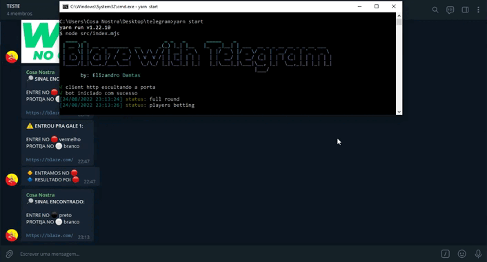
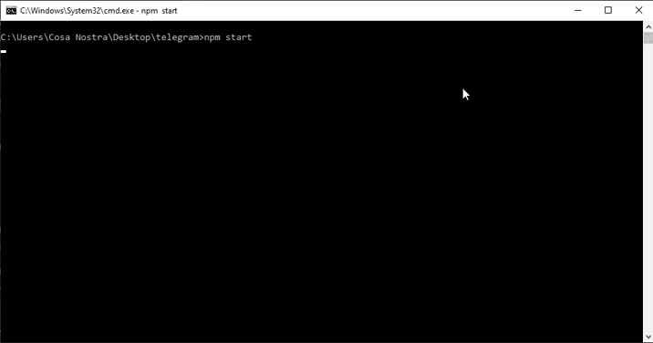

<div id="topo"></div>

<div align="center">
    <a style="text-decoration: none" href="https://blaze.com/r/dZONo">
        
    </a>

    <h2 align="center">Bot Blaze (Double)</h2>
</div>

O bot envia sinais grupos/canais/chat do telegram do gamer double do site [Blaze](https://blaze.com/pt/).


## Visualizar



## Requisitos

* [NodeJs](https://nodejs.org/en/download/)
* [Git](https://git-scm.com/downloads)

## Instalação

1. **Clone o repositorio**
```sh
git clone <repo>
```

2. **Instale as dependencias**
- npm
```sh
npm install
```
- yarn
```sh
yarn
```

3. **Variáveis de ambiente `(.env)`**
_dentro do repositorio existe um arquivo de exemplo `(.env.example)`_

```js
URL_BLAZE="" // url WS da blaze
BASE_URL="" // base url do site da blaze
BOT_TOKEN="" // token do bot telegram
ID_GROUP_MESSAGE="" // id do grupo/canal/chat do telegram que ira receber os sinais (string ou string[])
// ID_GROUP_MESSAGE=[""]

/**
 * Variáveis não obrigatorias
*/

REF="" // envia em todo sinal um link da blaze com sua referencia
```

## Uso

- npm
```sh
npm start
```

ou

- yarn
```sh
yarn start
```

</br>



## Contato

Instagram: <a href="https://www.instagram.com/elizandrodantas/" target="_blank">Elizandro Dantas</a>

<p align="right"><a href="#topo">topo</a></p>